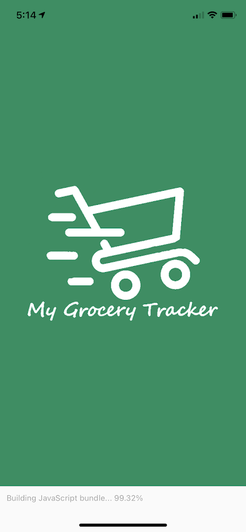
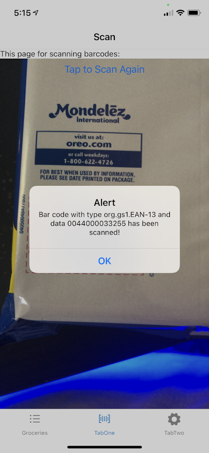

<div align="center">
  
</div>
<h1 align="center">
   Grocery Tracker App
</h1>
 
Cross platform application that will keep track of the groceries that are bought on a per home basis.

## How this will work
- Expo will be used. You can read more about it [here](https://docs.expo.io/)
    - Try to play around with it to get a better feel for this framework 

- The entries will be stored on a AWS database, probably dynamoDB because it'll make things simpler.
    - You can find a tutorial [here](https://aws.amazon.com/getting-started/hands-on/design-a-database-for-a-mobile-app-with-dynamodb/)
    - the connection to the DB will be done through AWS amplify which you can read about [here](https://blog.expo.io/how-to-build-cloud-powered-mobile-apps-with-expo-aws-amplify-2fddc898f9a2)

## Installation and Running

You can install this app using either npm or yarn as your package manager.

* You'll need [npm](https://nodejs.org/en/) to get started with either method.
* To run the app from source on your device, you'll need to install the [expo client app](https://expo.io/tools#client) on your device.

#### npm Method

1. Install command line tools for expo

   ```bash
   npm install --global expo-cli
   ```
2. Install dependencies (make sure you are inside the project root at this point!)

   ```bash
   npm install
   ```
3. Run the app!

   ```bash
   expo start
   ```
 
#### Yarn Method

1. Install yarn if you don't already have it

   ```bash
   npm install -g yarn
   ```
2. Install command line tools for expo

   ```bash
   yarn add global expo-cli
   ```
3. Install dependencies (make sure you are inside the project root at this point!)

   ```bash
   yarn install
   ```
4. Run the app!

   ```bash
   expo start
   ```
 
## Building

You can build a standalone android `.apk` file by running this command

   ```bash
   expo build:android -t apk
   ```

## Screen shots
- Splash Screen



- In App


